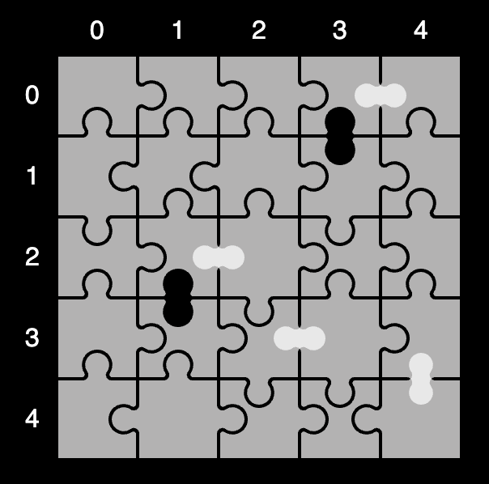

# #school
One of the more fun contests lol. Placed #16 last year so I had to do better. This year I placed 20th. 20th place of the students participated all over the world (735 students).

## Level 1
What can I say, level 1 was just generally very easy. You just had to count distinct lines and how many times it occured.

## Level 2
Level 2 required you to not just count distinct lines, but also distinctly recognize puzzle pieces. I did that by converting the pieces into binary "H,H,H,K" -> "0001". **H**ole and **K**nob so I made them zeros or ones. After which I turned the numbers 4 times, so in the same example it would create "0001", "1000", "0100", and "0010". By converting the binary number into a decimal number I checked which of these 4 were the highest value and kept that (basically sorting the pieces to be turned the same way). After which I counted these distinct numbers

## Level 3
At level 3 Cloudflight wanted you to fix a puzzle. You are given a puzzle like this:

The white showed that 2 knobs were facing eachother, and the black showed 2 holes facing each other. This had to be fixed by altering the puzzle pieces. My approach was 2 loops, where at every piece I would check the piece above, right, below, and left of it to see if they were facing the right way to each other. Eventually a result would pop out!

## Level 4
This was hard. A puzzle was given where all the edge pieces were already layed down, and you've gotten a list of the remaining pieces for the puzzle. I tried an approach first that would check by character rather by piece, this would've worked (eventually) but I noticed time running out & I didn't like the code ;-;

So I decided to try a 2nd approach. All logic was gone.

Thank you for listening to my ted talk